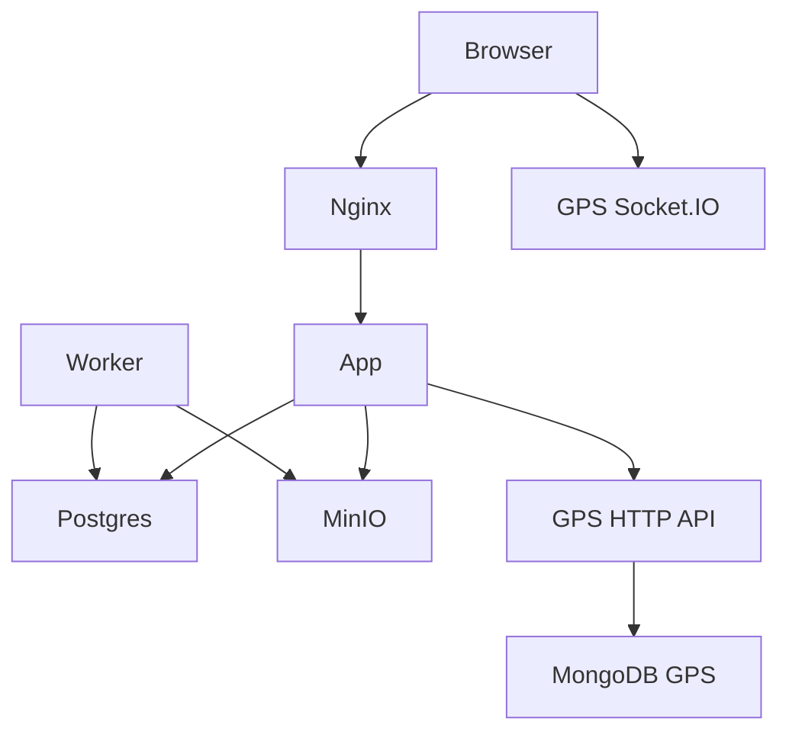

# Phase 5.1 — Deployment Architecture Audit

**Product:** Kodikz Smart City Mapping & Survey Guidance Platform  
**Branch:** `phase2/dubai-giscd-enhancements`  
**Date:** 2026-07-22  
**Review type:** Audit-first (no implementation · no deploy · no git)  
**Frontend:** FROZEN · RC1 READY FOR INTERNAL PILOT · Score 91/100  

---

## 1. Executive Summary

Phase 5.1 audited existing deployment assets against Internal Pilot needs. The **architecture package is largely complete and coherent** (Compose profiles, Dockerfile multi-stage, Nginx pilot config, Postgres migration, backup/restore scripts, health/readiness, env templates, prior Phase 3/24 ops docs).

**One verified production blocker** was found by static analysis: the production **runner image CMD invokes `pnpm`, but the runner stage never enables Corepack / installs pnpm**, so containers are expected to fail at process start. This workstation also **does not have Docker installed**, so image build and compose startup could not be executed here (environment limitation, not a design gap).

| Field | Value |
|-------|--------|
| **FINAL DECISION** | **2. INFRASTRUCTURE READY WITH MINOR ACTIONS** |
| **Infrastructure Score** | **74 / 100** |
| **Critical production blockers** | **1** (Dockerfile runner entrypoint) |
| **Proceed to Phase 5.2?** | **YES** — containerization fix + validation |

No frontend, API, SGE, or schema changes were made.

---

## 2. Infrastructure Inventory (5.1A)

| Asset | Present | Role |
|-------|---------|------|
| `Dockerfile` | Yes | Multi-stage: `deps` → `builder` → `runner` → `worker` |
| `docker-compose.local.yml` | Yes | Postgres + MinIO + app (ports published) |
| `docker-compose.pilot.yml` | Yes | Nginx + Postgres + MinIO + app + worker |
| `docker-compose.production-template.yml` | Yes | App + worker; external managed deps |
| `docker-compose.municipality-template.yml` | Yes | Same pattern as production template |
| `backend/docker-compose.yml` | Yes | **GPS backend** (Mongo + backend) — separate stack |
| `deploy/nginx/pilot.conf` | Yes | HTTPS, SSE, API, Socket.IO upgrade map |
| `deploy/backup/pg-backup.sh` | Yes | `pg_dump` custom format + SHA256 |
| `deploy/backup/pg-restore.sh` | Yes | `pg_restore` + count validation |
| `deploy/certs/` | **Missing** | Required by Nginx volumes |
| `deploy/scripts/` | **Missing** | No extra scripts dir (backup lives under `deploy/backup`) |
| `.env.pilot.example` | Yes | Pilot env template |
| `.env.municipality.example` | Yes | Municipality / OIDC template |
| `.env.local.example` / `.env.example` | Yes | Local templates |
| `.env.pilot` (runtime) | **Missing** on this host | Must be created for pilot |
| `.dockerignore` | Yes | Excludes `node_modules`, `.next`, `.env*`, `*.md` |
| `/api/health` | Yes | Aggregated dependency checks |
| `/api/readiness` | Yes | 503 when pilot deps unhealthy |
| Monitoring / metrics exporters | Partial | Structured logger present; no Prometheus scrape |
| Logging | Partial | JSON stdout logger (`src/lib/observability/logger.ts`) |
| Phase 3 / 24 ops docs | Yes | Docker, PG, security, backup, observability, pilot server reqs |

**Audit host evidence:** `docker` CLI **not installed**; `deploy/certs` **absent**; `.env.pilot` **absent**.

---

## 3. Architecture Review (5.1B)

### 3.1 Current architecture (as designed)

```text
[ Browser / Driver / Supervisor ]
              |
         [ Nginx :443 ]  (pilot compose; TLS)
              |
         [ Next.js App :3000 ] ---- Survey REST / SSE / Auth / RBAC
              |         \
              |          +-- [ Worker ]  (outbox / background)
              |
     +--------+--------+------------------+
     |                 |                  |
[ PostgreSQL ]   [ MinIO/S3 ]    [ External GPS Backend ]
  survey data     attachments     HTTP API + Socket.IO
                                  + MongoDB (GPS stack only)
```

GPS/Mongo are **not** part of the survey pilot Compose file; they remain the existing GPS service (`NEXT_PUBLIC_API_URL` / `NEXT_PUBLIC_SOCKET_URL` → `api-kodikz.giantphoenixllc.com` in pilot example).

### 3.2 Target Internal Pilot architecture

Same as current pilot Compose:

- Single VPS: Nginx + App + Worker + Postgres + MinIO  
- External GPS backend (unchanged)  
- Local auth (`AUTH_PROVIDER=local`, `MOCK_AUTH_ENABLED=false`)  
- TLS certs in `deploy/certs/`  
- Daily Postgres backup to durable storage  

Aligned with `PHASE24-PILOT-SERVER-REQUIREMENTS.md` (4–8 vCPU, 8–16 GB RAM).

### 3.3 Municipality production architecture (target)

```text
[ Municipality TLS / WAF / LB ]
              |
         [ App + Worker containers ]
              |
     +--------+--------+------------------+
     |                 |                  |
[ Managed PG ]   [ Managed S3 ]   [ Existing GPS+Mongo ]
[ Redis ]        [ OIDC IdP ]
```

Compose templates intentionally **omit** managed Postgres/Redis/S3 — env-driven only.

### 3.4 Dependency diagram



---

## 4. Gap Analysis (5.1C)

| Component | Status | Gap class | Pilot | Municipality |
|-----------|--------|-----------|-------|--------------|
| Next.js container definition | Implemented | — | Required | Required |
| Runner CMD (`pnpm` without Corepack) | **Defect** | **Critical** | Blocks start | Blocks start |
| Pilot Compose | Implemented | — | Required | N/A (template) |
| Nginx TLS config | Implemented | High (certs missing on host) | Required | Municipality proxy |
| HTTPS certificates | Missing on host | High (ops action) | Required | Required |
| Postgres 16 + healthcheck | Implemented | — | Required | Managed |
| Migrations (`migrate:pg`) | Implemented | Medium (not auto-run on boot) | Manual OK | Manual/CI |
| MinIO in pilot | Implemented | Medium (no healthcheck; app not waiting) | Required | Managed S3 |
| Worker service | Implemented | Medium (`tsx` is devDependency; OK today because full `node_modules` copied) | Required | Required |
| Redis | Optional / commented | Low | Not required (single instance) | Required when scaled |
| GPS / Mongo in survey Compose | Not included | — | **Not Required** (external) | External |
| Object storage backup script | Missing | Medium | Nice-to-have | Required |
| Resource limits (CPU/mem) | Missing | Low | Not required | Recommended |
| Compose networks (named) | Default only | Low | OK | Harden |
| App→MinIO startup order | Partial | Medium | Should fix in 5.2 | N/A |
| Liveness vs readiness split | Partial | Medium | Health exists; liveness always “ok” | Improve |
| Prometheus / metrics | Missing | Documentation / Medium | Not required | Recommended |
| CSP header | Missing in Nginx | Low | Optional | Recommended |
| Rate-limit env wired in config | Implemented in config | Medium (enforcement surface needs 5.4 deeper proof) | Acceptable with login lockout | Harden |
| Docker on audit workstation | Missing | Environment | Validate on pilot VPS / 5.2 host with Docker | — |

---

## 5. Deployment Readiness (5.1D)

| Check | Current | Evidence |
|-------|---------|----------|
| Dockerfile multi-stage | Present | `deps` / `builder` / `runner` / `worker` |
| Non-root user | Present | `kodikz` user |
| Image HEALTHCHECK | Present | Hits `/api/health` |
| Compose healthchecks | Partial | Postgres + app; MinIO/Nginx/worker lack app-style checks |
| Restart policy | Present | `unless-stopped` (pilot) |
| Startup order | Partial | App waits for Postgres healthy; not MinIO |
| Volumes | Present | `pgdata_pilot`, `minio_pilot` |
| Secrets | Env-file based | `.env.pilot` (not committed; example only) |
| Reverse proxy | Present | `deploy/nginx/pilot.conf` |
| HTTPS | Configured; certs absent | Volume `./deploy/certs` |
| Socket.IO via Nginx | Configured to `host.docker.internal:4000` | **Placeholder** — pilot app uses **external** GPS URLs; browser may talk to GPS host directly |
| Resource limits | Absent | — |
| Build reproducibility | Intended (`pnpm --frozen-lockfile`) | **Not executed** (no Docker) |
| This host validation | **Cannot run** | `docker` not recognized |

**Known issues (evidence-based):**

1. **Critical:** Runner `CMD ["pnpm","start"]` / worker `CMD ["pnpm","worker"]` without Corepack in runner stage.  
2. **High:** No TLS material under `deploy/certs`.  
3. **High:** No runtime `.env.pilot` on this host (expected; must be created from example).  
4. **Medium:** Nginx `gps_upstream` points at placeholder, not production GPS host (may be unused if clients connect to `NEXT_PUBLIC_SOCKET_URL` directly).

---

## 6. Database Readiness (5.1E)

### PostgreSQL (survey platform)

| Item | Status | Notes |
|------|--------|-------|
| Engine target | Postgres 16 (Compose) | Alpine image |
| Schema / migration | `POSTGRES_MIGRATION_001` + `migratePostgres()` | Versioned via `schema_migrations` |
| Script | `pnpm migrate:pg` | Manual step post-start |
| Indexes / constraints | In migration SQL | CHECKs, FKs, UNIQUEs present |
| Seed | Roles, permissions, default tenant | In migrate |
| Pool | `pg` Pool, `DATABASE_POOL_MAX` | Configured |
| SSL flag | `DATABASE_SSL` | Pilot example `false`; municipality `true` |
| Backup | `deploy/backup/pg-backup.sh` | Requires `pg_dump` + `DATABASE_URL` |
| Restore | `deploy/backup/pg-restore.sh` | Count check after restore |
| Backup/restore proven on this host | **No** | No local Postgres/Docker |

### MongoDB (GPS backend only)

| Item | Status | Notes |
|------|--------|-------|
| In survey Compose | **Not present** | Correct — GPS owns Mongo |
| GPS stack | `backend/docker-compose.yml` mongo:7 | Healthcheck ping |
| Survey app dependency | HTTP/Socket to GPS API | No direct Mongo driver in survey app (inventory) |

**Schema redesign:** none recommended; none performed.

---

## 7. Security Review (5.1F)

### Controls present (evidence)

| Control | Evidence |
|---------|----------|
| JWT sessions | `jose` SignJWT / jwtVerify in `provider.ts` |
| Cookie / Bearer extract | `kodikz_access` cookie + Authorization |
| RBAC / permissions | `permissions.ts`, `withSurveyAuth`-style API helpers |
| Pilot rejects mock auth | `app-config` ConfigError if mock in pilot/municipality |
| JWT secret min length | ≥32 chars required in pilot |
| S3 credentials required in pilot | Config validation |
| Nginx security headers | X-Frame-Options, nosniff, Referrer-Policy, Permissions-Policy |
| Login lockout map | In-memory attempts in auth provider |
| Seeded pilot password | Documented `ChangeMe!Pilot1` — **must rotate** |

### Security Risk Matrix

| Risk | Severity | Likelihood | Pilot impact | Mitigation |
|------|----------|------------|--------------|------------|
| Default/seed credentials if not rotated | High | Medium if ops skip | Account compromise | Rotate before pilot go-live |
| TLS certs missing | High | Certain until provisioned | No HTTPS / Nginx fail | Issue certs into `deploy/certs` |
| `pnpm audit`: sharp (high), postcss (moderate) via Next | Medium | Known transitive | Supply-chain | Track Next upgrades; accept for internal pilot with monitoring |
| No CSP header | Low | Low | XSS defense-in-depth | Add in Nginx later |
| Rate-limit env vs enforcement depth | Medium | Unknown without route-level proof | Abuse of login/upload | Confirm in 5.4; login lockout exists |
| `DATABASE_SSL=false` on pilot | Low | Acceptable on private Docker net | MitM on PG | Keep private network; SSL for municipality |
| Secrets in env files on disk | Medium | Ops dependent | Leak | File perms; never commit `.env.pilot` |

### `pnpm audit` (executed)

- **2 vulnerabilities:** 1 high (`sharp` via `next`), 1 moderate (`postcss` via `next`)  
- Not treated as Critical blockers for **internal** pilot; track for municipality.

---

## 8. Observability Review (5.1G)

| Capability | Status | Notes |
|------------|--------|-------|
| `/api/health` | Implemented | Always HTTP 200 with `status:"ok"` + nested checks — **does not fail** when PG/storage down |
| `/api/readiness` | Implemented | Returns **503** when pilot PG/storage unhealthy |
| Structured JSON logs | Implemented | `log()` with secret scrubbing |
| Request ID | Partial | API helpers + Nginx `X-Request-ID` |
| Audit events | In Postgres schema / survey audit APIs | Present in platform |
| Metrics (Prometheus) | Missing | Not required for internal pilot |
| Socket logging | GPS-side / client | External GPS |
| Error reporting (Sentry etc.) | Missing | Documentation / future |
| Nginx `/health` `/readiness` routes | Present | Proxy to app |

**Production visibility for internal pilot:** adequate via readiness + JSON logs + survey audit, **if** log aggregation is configured on the VPS. Missing dedicated metrics is **Not Required for Internal Pilot**.

---

## 9. Operational Readiness (5.1H)

| Document | Status |
|----------|--------|
| Phase 3 Docker / Nginx / Postgres / Backup / Security / Observability | Present |
| Phase 24 Docker, Backup-Restore, Pilot Server Requirements, Deployment GO/NO-GO | Present |
| Phase 4.2F Readiness Review | Present (app RC1) |
| Single consolidated “Operations Manual” for RC1 infra | **Partial** — spread across Phase 3/24; Phase 5.8 will consolidate |
| Rollback guide | Partial (compose down / prior image; not one checklist) |
| Incident response | Partial |
| Backup/restore runbook | Scripts + Phase docs; **not validated** on this host |

**Completeness for pilot:** documentation **exists but fragmented**; operational proof (backup drill, compose up) **pending Phase 5.2/5.6 on a Docker host**.

---

## 10. Risk Matrix (summary)

```
Critical:  Dockerfile runner/worker CMD uses pnpm without Corepack
High:      TLS certs + .env.pilot provisioning; seed password rotation
Medium:    MinIO health/order; health endpoint always 200; audit validation; transitive CVEs
Low:       Resource limits; CSP; Redis; Nginx gps_upstream placeholder
Env:       No Docker on this audit workstation (blocks local proof)
```

---

## 11. Priority Matrix

| Priority | Item | Pilot relevance | Municipality relevance |
|----------|------|-----------------|------------------------|
| P0 | Fix container entrypoint (Corepack or `node`/Next direct CMD) | Blocks all container pilots | Same |
| P1 | Provision `.env.pilot` + TLS certs on pilot VPS | Blocks HTTPS pilot | Municipality TLS |
| P1 | Rotate seeded auth passwords | Security | Security |
| P2 | MinIO healthcheck + `depends_on` | Reliability | N/A if managed S3 |
| P2 | Prove `pg-backup` / `pg-restore` once | Ops gate | Ops gate |
| P3 | Resource limits, CSP, metrics | Optional | Recommended |
| P3 | Consolidate ops manuals (Phase 5.8) | Ops clarity | Required |

---

## 12. Verified Production Blockers

### BLOCKER-51-01 — Runner/Worker image entrypoint (`pnpm` missing)

| Field | Content |
|-------|---------|
| **Evidence** | `Dockerfile` runner stage: no `corepack enable`; `CMD ["pnpm","start"]` and worker `CMD ["pnpm","worker"]`. `node:20-bookworm-slim` does not ship pnpm on PATH by default. |
| **Risk** | Containers exit immediately; pilot stack cannot serve traffic. |
| **Impact** | Critical — no Internal Pilot on Compose until fixed. |
| **Priority** | P0 |
| **Pilot relevance** | Direct blocker |
| **Municipality relevance** | Same images |
| **Rollback** | Revert CMD/Corepack change; keep prior image tag |
| **Validation** | `docker build` + `docker compose -f docker-compose.pilot.yml up`; container stays healthy; `/api/readiness` 200 |
| **Implementation** | Deferred to **Phase 5.2** (per STOP — do not implement in 5.1) |

Suggested fix options (for 5.2, not applied now):

1. `RUN corepack enable && corepack prepare pnpm@10.33.4 --activate` in runner before USER switch; or  
2. `CMD ["node","node_modules/next/dist/bin/next","start"]` and worker via `node --import tsx` / compiled JS.

---

## 13. Implementation Plan (blockers only)

| Step | Owner | Phase | Action |
|------|-------|-------|--------|
| 1 | DevOps | **5.2** | Fix Dockerfile entrypoint; rebuild runner/worker |
| 2 | DevOps | **5.2** | On Docker-capable host: build + `compose.pilot` up; verify health/readiness |
| 3 | DevOps | **5.2** | Add MinIO healthcheck + app dependency (if needed after start tests) |
| 4 | Ops | **5.2 / 5.6** | Create `.env.pilot`, certs; run backup/restore drill |
| 5 | Security | **5.4** | Rotate seeds; review audit CVEs for accept/fix |

**No other code changes recommended from this audit.**

---

## 14. Pilot vs Municipality Readiness

| | Internal Pilot | Municipality Production |
|--|----------------|-------------------------|
| Architecture design | Sufficient after P0 fix | Templates sufficient |
| Executable proof on this PC | Incomplete (no Docker) | N/A |
| Auth model | Local JWT OK | OIDC template ready; not validated live |
| Data stores | PG + MinIO in Compose | Managed PG/S3 expected |
| GPS/Mongo | External OK | External OK |

---

## 15. Recommendations

1. **Proceed to Phase 5.2 — Containerization** immediately to clear BLOCKER-51-01 and prove builds/startup.  
2. Perform Phase 5.2 validation on a **Docker-installed** host (pilot VPS or developer machine with Docker Desktop).  
3. Do **not** redesign schema, APIs, or frontend.  
4. Treat Mongo connectivity as **GPS-stack ownership**, not survey Compose scope.  
5. Defer Prometheus/CSP/resource limits to later hardening unless 5.2 reveals related failures.

---

## 16. GO / NO-GO & Score

| Item | Result |
|------|--------|
| **Decision** | **2. INFRASTRUCTURE READY WITH MINOR ACTIONS** |
| **Infrastructure Score** | **74 / 100** |
| **Why not (1) fully ready?** | Verified container entrypoint blocker + unproven backup/TLS/compose on this host |
| **Why not (3) not ready?** | Overall architecture, Compose, Nginx, PG migration, backup scripts, health/readiness, and env templates are present and suitable for internal pilot once P0 is fixed and validated |

### Quality gate mapping (honest)

| Gate | Status |
|------|--------|
| Containers build cleanly | **Not proven** (no Docker) + entrypoint defect |
| Services start cleanly | **Blocked** until P0 |
| Databases healthy | Design OK; not live-proven here |
| Backups / restore validated | Scripts present; **not validated** |
| Security acceptable for internal pilot | **Acceptable with actions** (certs, rotate secrets, track CVEs) |
| Monitoring operational | Partial (logs + readiness) |
| Docs | Fragmented but present |

---

## 17. FINAL DECISION

# **2. INFRASTRUCTURE READY WITH MINOR ACTIONS**

**Support:** Architecture assets are sufficient for an Internal Pilot design. One **Critical** Dockerfile entrypoint defect must be fixed and containers validated in **Phase 5.2**. Remaining gaps are High/Medium ops actions (certs, env, backup drill), not architecture rewrites.

**Recommended next step:** Approve and start **Phase 5.2 — Containerization** (fix entrypoint → build → compose up → health checks).

---

## STOP

- No improvements implemented in this phase  
- No commit · No push · No deploy · No tags · Frontend remains frozen  

*End of Phase 5.1 Deployment Architecture Audit.*
